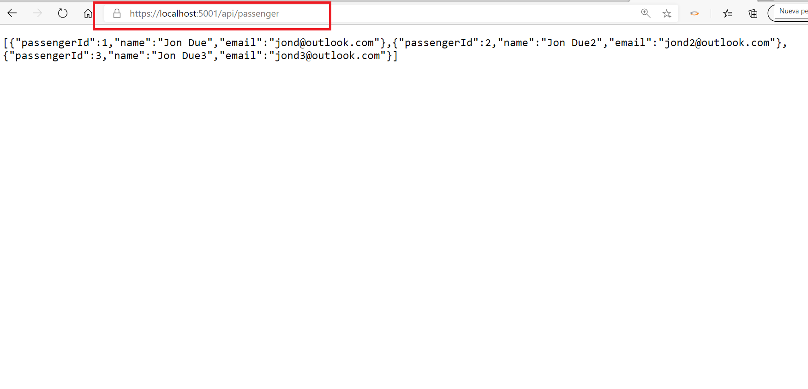

# Injecting-Dependencies-into-Controllers

1. **Nombres y apellidos:** Carola Casais Recondo
2. **Fecha:** Miércoles 23 de diciembre de 2020
3. **Resumen del Ejercicio:** EL objetivo es realizar una inyección de dependencias en los controladores.
4. **Dificultad o problemas presentados y como se resolvieron:** No hubo dificultades.
